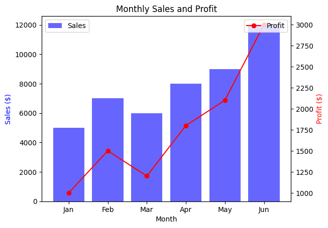

# Mastering-Data-Visualization-Techniques-and-Examples
"Mastering Data Visualization" provides an overview of techniques and chart types, to enhance data interpretation and communication, empowering readers to present complex insights effectively and clearly.

